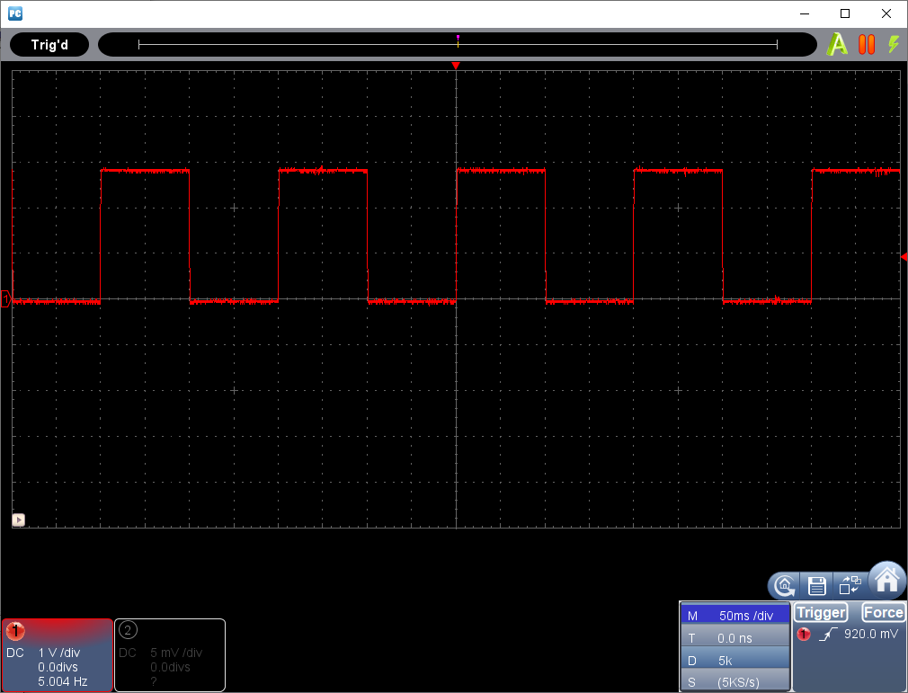
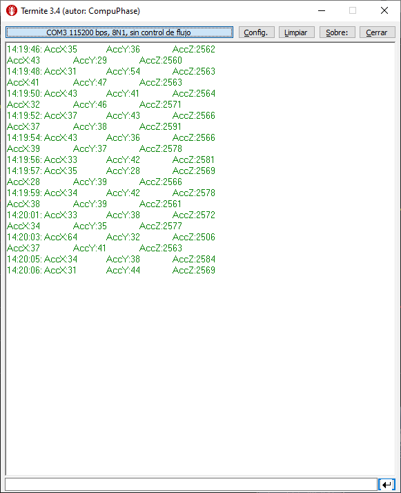
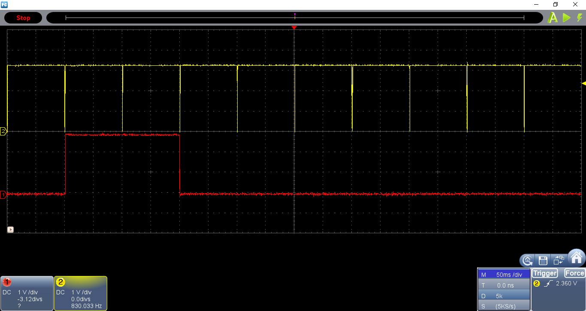

# RSENSE20_ANGOSTO_P2

Estrcutra de proyecto basada en: [ESP-IDF template](https://github.com/espressif/esp-idf-template).
Repositorio para la práctica P2 de redes de sensores.

## Primer punto:
Commit 373435b, con FreeRTOS se crean dos tareas.
1. Parpadeo LED con período de 200ms.
2. Envío por puerto serie texto "hola mundo" con un período de 1s.
### Montaje

### Captura Terminal con mensaje.

### Captura osciloscopio señal LED.

[Primer punto video demostración](https://vimeo.com/529930490).

## Entregable 1 :
Commit f3ae3b8 lectura IMU (MPU9250) cada 100 ms, trasmisión de datos cada segundo y encendido de LED por 200ms.

### Montaje

### Captura Terminal con mensaje.

### Captura osciloscopio señal LED.

[Entregable1 video demostración](https://vimeo.com/526973582).

---
## Bibliografía:
* [ESP-IDF template](https://github.com/espressif/esp-idf-template).
* [Espressif API reference](https://docs.espressif.com/projects/esp-idf/en/latest/esp32/api-reference/index.html).
---
David Angosto Latorre, 633706
