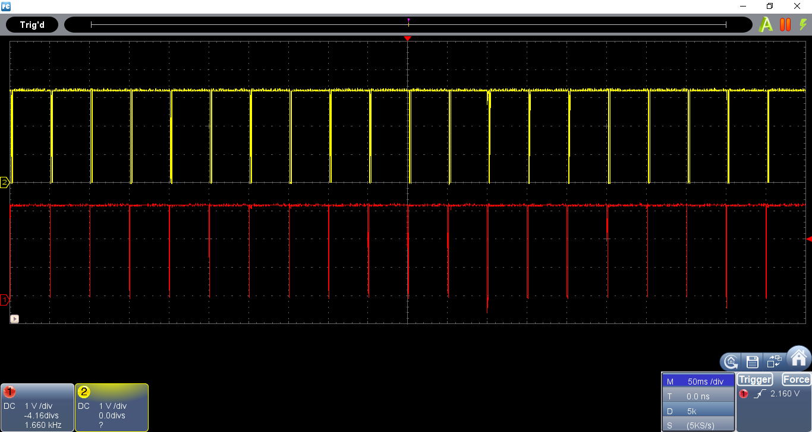

# RSENSE20_ANGOSTO_P3

Estructura de proyecto basada en: [ESP-IDF template](https://github.com/espressif/esp-idf-template).
Repositorio para la práctica P3 de redes de sensores.

## Programa base:
Commit 430c7.
Lectura cada 50 ms de IMU y trasmisión de datos por puerto serie, basado en FreeRTOS, programa modificado en base al de RSENSE20_ANGOSTO_P2.
Progrma para EPS32 base para el desarrollo del programa en Python. Formato de los mensajes:
```C
"AccX:%d\tAccY:%d\tAccZ:%d\t\r\n",accX,accY,accZ 
```

### Montaje


### Captura Terminal con mensaje de lectura IMU.


### Captura osciloscopio conmunicación I2C y UART.
El canal amarillo corresponde a la señal Tx de la UART hacia el PC.
El canal rojo es la señal SCL de la comunicación I2C hacía la IMU



[Programa base video demostrativo](https://vimeo.com/565305656).

## Primer punto:
Commit 7d7fb1.
Emulación terminal puerto serie mediante programa Python, uso del módulo Pyserial.

### Captura Terminal python.


## Entregable 1 :
Commit  cca401.
Almacenamiento de datos en archivo .txt con datos separados por ;.
Corrección archivo Python para manejo de excepción ^C para salida de programa y cierre de archivo y puerto serie.

[Archivo ejemplo](./python/AccData.txt)

## Entregable 2 :
Media y desviación estandar de aceleración guardados en .txt con ; como separador, se guardan cada 5 segundos.

[Archivo ejemplo](./python/Acc_Mean_std.txt)


---
## Bibliografía:
* [ESP-IDF template](https://github.com/espressif/esp-idf-template).
* [Espressif API reference](https://docs.espressif.com/projects/esp-idf/en/latest/esp32/api-reference/index.html).
* [Numpy](https://numpy.org/)
* [Pyserial](https://pyserial.readthedocs.io/en/latest/)
* [Matplotlib](https://matplotlib.org/)
---
David Angosto Latorre, 633706
